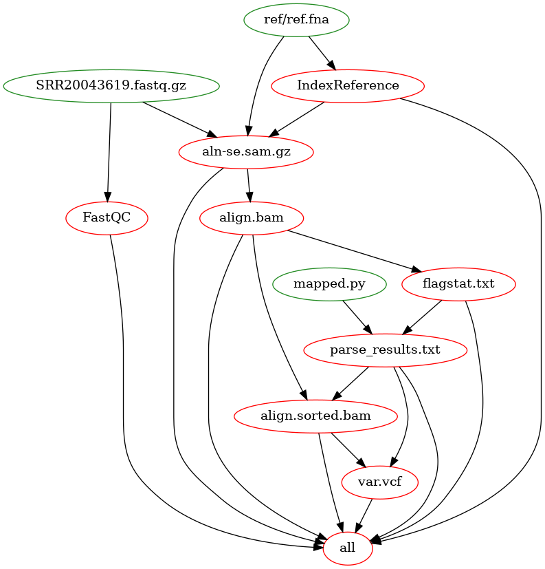

Ссылка на прочтения
https://www.ncbi.nlm.nih.gov/sra/SRX16082129[accn]


## Установка
GNU Make обычно предустановлен на дистрибутивах линукс систем.<br>
Но если не установлен, то для Ubuntu:
```
sudo apt install make
```

Также для самостоятельной визуализации графа потребуется graphviz:
```
sudo apt install graphviz
make visualize
```
## Запуск
Для запуска всего пайплайна:
```
make NAME=<read_file_name>
```
По умолчанию `NAME = SRR20043619.fastq.gz`, в этом файле лежит выбранный результат секвенирования. Так что для запуска достаточно только
```
make
```
\- результаты работы такого вызова сохранены в файле results.txt

## Визуализация

Визуализированный Makefile:


В отличие от блок-схемы алгоритма здесь вершинами обозначаются файлы, которые генерируются в процессе работы пайплайна (FastQC и IndexReference также генериуют файлы, но их названия оставлены такими для простоты графа). 

Также можно заметить что последующие этапы пайплайна могут зависеть не только от ближайшего предыдущего этапа, но и от других предыдущих. Например, оба этапа после проверки результатов (samtools sort и freebayes / align.sorted.bam и var.vcf) зависят от файла с этими результатами (parse_results.txt).

Вершина `all` нужна для запуска всего пайплайна разом.
