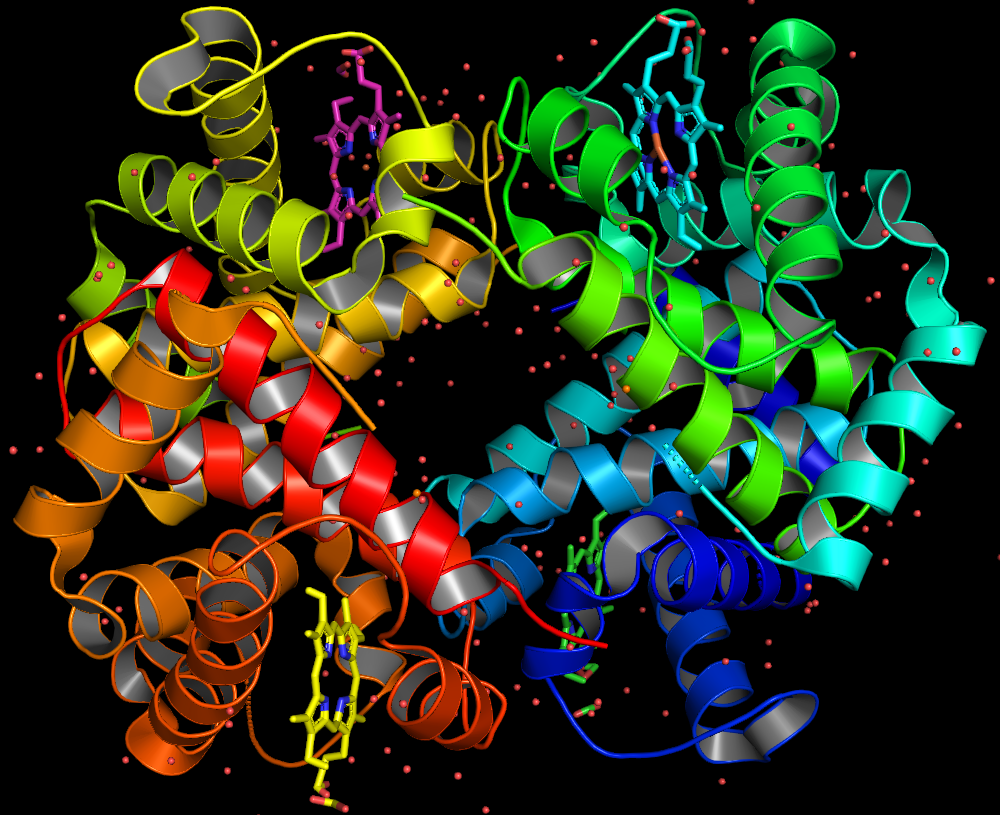

# Домашнее задание 5. Визуализация структуры белка

ПО для визуализации: __PyMOL__

Структура белка: https://www.rcsb.org/structure/4HHB

## Визуализации

### Wireframe

### Backbone

### Spacefill (с цветовой моделью CPK)

### Ribbons (с расскраской по частям белка)

### Molecular surface

### Публикационного качества

## Способ получения визуализации

### Wireframe
protein_model -> S (show) -> as -> wire (lines)

### Backbone
protein_model -> S (show) -> ribbon

### Ribbons
protein_model -> S (show) -> cartoon

### Molecular surface
protein_model -> S (show) -> surface

### Раскраска по доменам белка
protein_model -> C (color) -> by chain -> by chain

### Цветовая модель CPK

по крайней мере самое близкое к CPK, что я нашёл